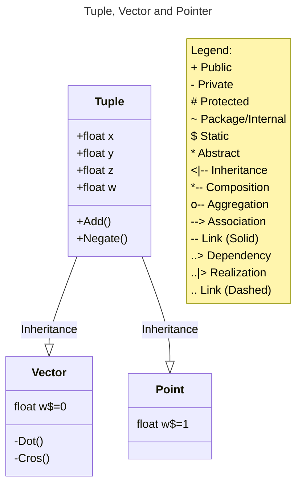

# ray-tracing

## Class Diagrams

## Chapter 1
### Add
- Vector + Vector => Vector
- Vector + Point => Point
- NO ALLOWED: Point + Point => (w=2)

### Subtract
- Vector - Vector => Vector
- Point - Vector => Point
- NOT ALLOWED: Vector - Point => (w=-1)

### Negate
- (x, y, z, w) => (-x, -y, -z, -w)

### Scalar Operations
- s * (x, y, z, w) => (s*x, s*y, s*z, s*w)
- (x, y, z, w) / s => (x/s, y/s, z/s, w/s)

### Magnitude
- |v| = sqrt(x^2, y^2, z^2, w^2), where w = 0, i.e. vector

### Normalization
- (x/|v|, y/|v|, z|v|, w/|v|)

### Dot Product
- (vector1, vector2) => scalar, i.e. x1 * x2 + y1*y2 + z1*z2 + w1*w2

### Cross Product
- (vector1, vector2) => (vector3)
- i.e. (a.y * b.z - a.z * b.y, a.z * b.x - a.x * b.z, a.x * b.y - a.y * b.x)


## Test Frameworks
### [Ginkgo](https://onsi.github.io/ginkgo/#getting-started)

### [Bootstrapping a Suite](https://onsi.github.io/ginkgo/#bootstrapping-a-suite)
Generate a new test suite in the current directory:
```bash
cd path/to/books
ginkgo bootstrap
```

### Running Tests
- Run the tests in the current directory:
```bash
ginkgo
```
- Run all tests for the project:
```bash
go run github.com/onsi/ginkgo/v2/ginkgo -r --randomize-all --randomize-suites --fail-on-pending --keep-going --cover --coverprofile=cover.profile --race --trace --json-report=report.jso
```

### [Adding Specs to a Suite](https://onsi.github.io/ginkgo/#adding-specs-to-a-suite)
This will generate a test file named book_test.go in the books directory:
```bash
```shell
ginkgo generate book
```
